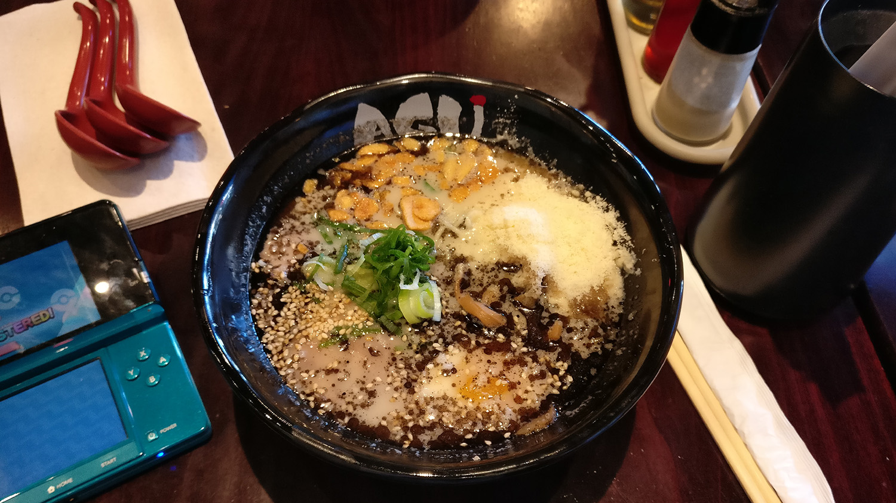

The star of this ramen is the savory broth! (not the parmesan - but that was
also very good)

*AGU Ramen, $16.00*

Don't mind the 3DS - I had just started playing Pokemon Sun.  The broth is
*tonkotsu*, which is made from pork bones. It's a pretty rich and heavy broth.
I definitely felt guilty after eating all this ramen for lunch, but in a, err...
good way? It was super tasty. I'm definitely going to try put parmesan in my
ramen!
