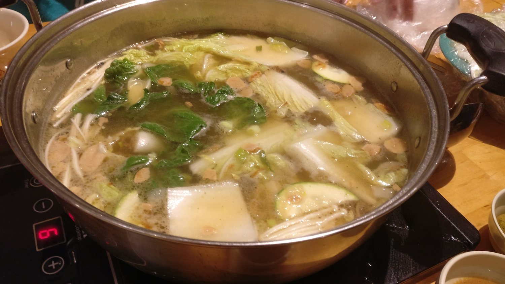
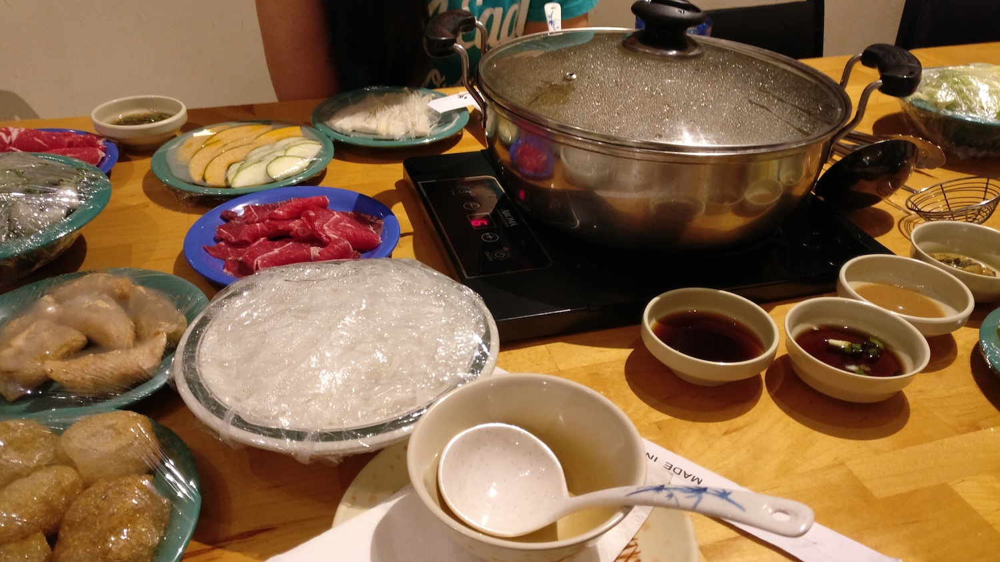
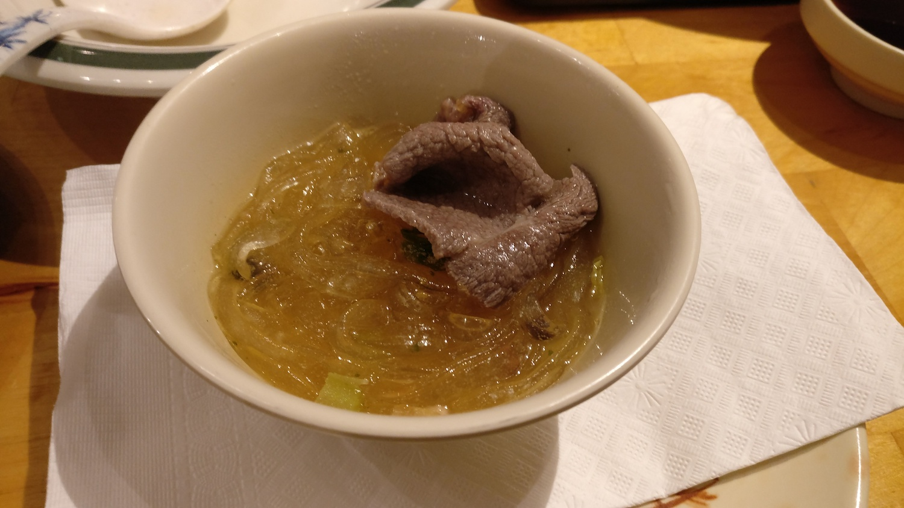
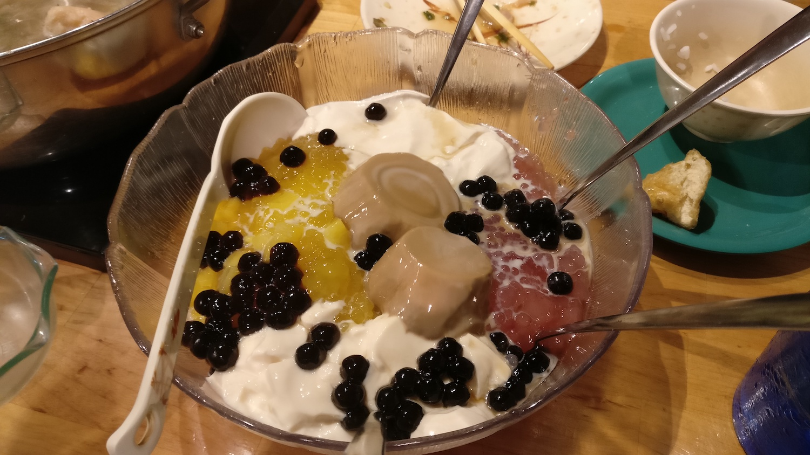

The more the merrier! Hot pot is such an intimate way of eating food with your
friends/loved ones :)

*Sweet Home Cafe, $8.95 (for the Summer Garlic broth)*

*Sweet Home Cafe, dishes are $3-5*

*Sweet Home Cafe, FREE!*

For those not familiar with hot pot, you boil the broth in front of you, and
cook food (usually vegetables and meat, though my favorite is
[youtiao](https://en.wikipedia.org/wiki/Youtiao)) throughout the whole meal.

I actually came here twice...once on the 2nd and once today. I *love* this place
because the dessert they serve at the end is on the house! It usually comes out
to ~$20/person after taxes+tip! The best thing about hot pot is that it scales
well with people; you can fit 4 people/pot. The dessert also scales! <i
class="em em-grin"></i>
