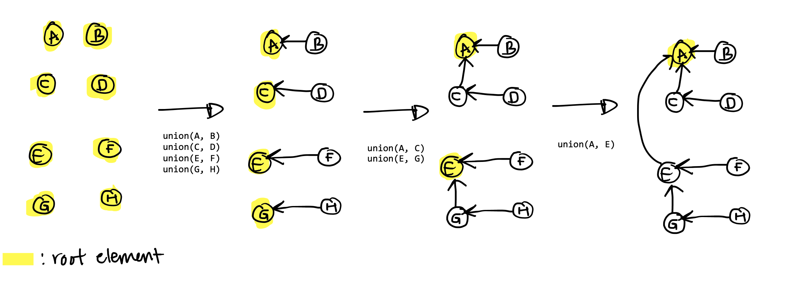

* toc
{:toc}

## Review of Weighted Quick Union
A WQU data structure lets us efficiently represent and interact with disjoint
sets. Given $$n$$ elements, which start off as $$n$$ one-element sets, we can
call `union` on any two elements to union the two sets they belong to. Weighted
quick union gives us a runtime bound of $$O(\log{n})$$ for any call to `union`.
This is due to the _weighted_ component of the algorithm: the union will always
make the set with a less elements a child of the set with more elements.  See
the below image (taken from this [page](https://algs4.cs.princeton.edu/15uf/)):


The only way to increase the height of a set's tree representation is if you
union two sets with the same number of elements (try to draw a few examples and
visualize this). As a result, the upper bound on the height of a set's tree is
$$\log{n}$$. To end up with a tree with height $$\log{n}$$, pairwise union all
equal-sized sets, and do this $$\log{n}$$ times. Each time you union two
equal-sized sets, the height of the resulting set is increased by $$1$$, so the
tree at the end has height $$\log{n}$$. See below for $$n = 8$$:



This means the bound on the runtime of calling `find`, which
finds the root of a set based on an element, is $$O(\log{n})$$, since an element
at the bottom of the tree would have to traverse the entire height of the tree
to reach the root.

To make `find` asymptotically faster, we will use path compression every time
we call `find`.

## Path Compression
Here is the pseudo-code of `find` with path compression:

```python
def find(el):
    if el is not the root:
        el.parent = find(el.parent)
    return el.parent
```

This above pseudo-code is quite dense, try to work through it. Path compression
takes all the nodes in the _path_ traversed (starting at `el` and ending at the
root) and makes each node a child of the root (hence, it is compressing the
path). Here is an example:

```
     A
   / | \
  B  C  D
    / \
   E   F
  / \
 G   H
```

Calling `find(G)` will transform the tree to become this:
```
       A
  / / |  | \ \
 B C  E  D  E G
  /   |
 F    H
```
(`C` and `E` got moved up to be children of the root).

The key insight to why path compression gives a better runtime for $$m$$ calls
to `find` (if $$m >> n$$) is because everytime you call `find`, you do some work
that flattens the tree, and ultimately gives `find` an amortized runtime of
$$O(\log^{\ast}{n})$$.

## Proof of amortized $$O(\log^{\ast}{n})$$ find for WQU-PC
The iterated logarithm, $$\log^\ast n$$ is defined as the number of times you
apply $$\log$$ until you get $$\leq 1$$. For example, $$\log_2^\ast2^{2^2}
= 3$$. $$\log^\ast$$ grows _very slow_, see the below example for some intuition
why:

$$
\begin{align}
    2^{2^{2^{2^{2^{2}}}}} &= 65,536 \\
    2^{2^{2^{2^{2^{2^{2}}}}}} &= 4,294,967,296 \\
    log_2^\ast{(65,356)} &= 4 \\
    log_2^\ast{(4,294,967,296)} &= 5 \\
\end{align}
$$

In general, an algorithm with time complexity $$\log^\ast n$$ would be very fast
as $$n$$ grows larger (just below constant time!), so this is quite desirable.

First, let's define the $$rank$$ of a root to be the height of its underlying
tree. Before any `union` calls are made, each element, which is the root of its
own one-element set, has $$rank = 0$$. When we union two sets with equal
$$rank$$, we increment the root of the unioned set's $$rank$$ by $$1$$, because
the underlying tree has had its height increased by $$1$$.

I will use "root" and "tree" interchangeably, so when I say a "the number of
elements in a root of $$rank = k$$", I really mean "the number of elements in
the tree that has a $$rank = k$$ root". 

### Two Properties
Here are two useful properties of $$rank$$ that will be used in our proof later:

<a name="prop-1">
#### (1) For every element $$e$$, $$rank(e) > rank(e\text{.parent})$$

If $$rank(e) = k$$, that means it was created by unioning two elements whose
sets had $$rank = k-1$$.

<a name="prop-2">
#### (2) If there are $$n$$ elements, there are at most $$n/2^k$$ elements of $$rank = k$$
An important observation: elements that are no longer roots still have a
$$rank$$ because in the beginning, they started out as roots of their own
one-element set. Note that their $$rank$$ can no longer increase once they
become a child of another root.

First, let's prove that a root with $$rank = k$$ has at least $$2^k$$ elements.

The total number of elements $$T(k)$$ for a root of $$rank = k$$ is something we
can lower bound. $$T(k)$$ is *at least* the sum of the number of elements in the
two equal-ranked trees that were merged. Observe that this is a lower bound
because you could always increase the number of elements without increasing the
rank by unioning in more roots with $$rank < k$$.

$$
\begin{align}
&T(k) \leq T(k-1) + T(k-1) \\
&T(0) = 1 \quad \text{a tree with no height has just one element (the root).}
\end{align}
$$

Expanding and simplifying $$T(k)$$:

$$
\begin{align}
T(k) &\leq T(k-1) + T(k-1) \\
&= 2[T(k-1)] \\
&= 2[T(k-2) + T(k-2)] \\
&= 2[2[\ldots[T(0) + T(0)]\ldots]] \\
&= 2[2[\ldots[2]\ldots] \\
&= \prod_{i=0}^{k}2 \\
&= 2^{k}
\end{align}
$$

This means that if we have $$n$$ elements, there are at most $$n/2^k$$ elements
of $$rank = k$$, since each root with $$rank=k$$ has at least $$2^k$$ elements.
This means the highest possible $$rank$$ is $$\log n$$ since there is at most
one root with $$2^{\log n} = n$$ elements.

Onto the proof...

### Amortization
What we're going to try prove is that for a call to `find`, the time complexity
is $$O(\log^\ast n)$$. Some calls to `find` might take some extra work, but we
will be able to bound _the total amount of extra work $$E(n)$$ over all calls_ to `find`
as a function of the number of elements ($$n$$).

We will then show that if you $$m$$ calls to `find`, $$E(n)$$ becomes negligible
when $$m >> n$$, .  This is the soul of amortization.

According to [(2)](#prop-2), the possible range of ranks an element could have
is $$[0, \log n]$$. Let's divide this range of non-zero ranks into the following
groups:

$$
\begin{align}
    &\{1\} \\
    &\{2\} \\
    &\{3, 4\} \\
    &\{5, 6, \ldots, 15, 16\} \\
    &\{17, 18, \ldots, 2^{16}\} \\
    &\vdots \\
\end{align}
$$


Each group has the form $$\{r + 1, r + 2, \ldots, 2^{r}\}$$.
In total, there are $$\log^{\ast} n$$ groups.

#### Bounding $$E(n)$$

Recall in [(2)](#prop-2) that once an element is no longer a root, it's rank can
no longer increase.  We will give each _child element_ with $$rank = k$$ the
ability to take $$2^r$$ total extra steps over all calls to `find`, where $$r$$
is the first value of the group that $$k$$ falls in.

**Claim:** The total amount of extra steps we give is at most $$n\log^\ast n$$.
That is, $$E(n) \leq n\log^\ast n$$.

**Proof:**
Child elements with $$rank = k$$ that are in the group
$$\{r + 1, r + 2, \ldots, 2^{r}\}$$ each get $$2^r$$ extra steps. From
[(2)](#prop-2) we can upper bound the total amount of child elements with a rank
in that group:

$$
    \dfrac{n}{2^{r + 1}} +
    \dfrac{n}{2^{r + 2}} +
    \ldots
    \leq
    \dfrac{n}{2^r}
$$

For each group, the total amount of extra steps given is at most $$n$$, and
there are $$\log^\ast$$ groups.

#### Bounding find
We will define the amount of work done by `find(e)` as the length of the path
between `e` and the root. Consider the elements $$x$$ in this path, ranks
ascending (see [(1)](#prop-1)). Each element $$x$$ has $$rank = r_x$$.  Each
element's parent $$x\text{.parent}$$ has a $$rank = r_p$$ that is either in a
larger group or the same group as $$r_x$$.

Two observations:
1. At most $$\log^\ast{n}$$ elements would have parents with a rank in a larger
   group.  (Why? That's how many groups there are.)
2. If $$x\text{.parent}$$ has a rank that is in the same group as the rank of
   $$x$$, $$x$$ will use one of its allocated extra work steps.

Observation 1 implies a $$O(\log^{\ast}n)$$ time complexity of `find` if we can
prove that each child element does not spend more work steps than it was
allocated.

Every time a child element uses one of its extra work steps, it's parent becomes
one with a higher rank (path compression changes its parent). A child element
needs at most $$2^r$$ extra steps to change to a parent that has a rank in a
higher group. Once its parent's rank is in a higher group, it does not need any
more extra steps because of Observation 1.

The total time complexity of $$m$$ calls to `find` on $$n$$ elements is:

$$
\leq m \log^\ast n + E(n) \\
= m \log^\ast n + n\log^\ast n \\
\in  O(m \log^\ast n) \quad \text{assuming } m >> n\\
$$

At last, we have proved that the amortized runtime of `find` is
$$O(\log^\ast n)$$.

You can prove an even tighter upper bound, see [this
paper](https://core.ac.uk/download/pdf/81136382.pdf) for more.

### Corollary: Amortized $$O(\log^{\ast}{n})$$ union
Since `union`'s time complexity depends on `find`, `union` also has an amortized
runtime of $$O(\log^\ast n)$$.
