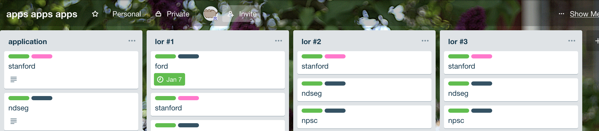

I finished applying to graduate school programs last year! Here's my recounting
of the process.

**Table of Contents**
* TOC
{:toc}

# Advice that really helped me
- Jean Yang's [whole series on CS grad school](https://jxyzabc.blogspot.com/2008/08/cs-grad-school-part-4-applications.html)
- Philip Guo's advice on [graduate school applications](http://www.pgbovine.net/grad-school-app-tips.htm) and [fellowships](http://www.pgbovine.net/fellowship-tips.htm)
    - His [memoir](http://www.pgbovine.net/PhD-memoir/pguo-PhD-grind.pdf) is a fun read too!
- Justine Sherry's [advice](https://people.eecs.berkeley.edu/~justine/advice.pdf)
- Mor Harchol-Balter's [advice](https://www.cs.cmu.edu/~harchol/gradschooltalk.pdf)

# Deadlines!
Most CS graduate applications are due in mid-December.

**HOWEVER**, most fellowship applications are due 1-2 months before that!
Finishing fellowship applications puts you in a good position to coast through
your graduate school applications. Your ducks (rec. letters, SOP, misc.
materials) will be properly lined up.

# Getting Organized
I was casting a wide net, which means I had _a lot_ of applications to
submit. I found that a [Trello](https://trello.com) Board was the
most effective way of tracking my deadlines for each application.

I created four columns: overall application status and one for each
recommendation letter writer. In each column, I put one card for each
application I (or my recommender) had to complete.

I used labels to color-code the status and type of each card. Then, I could
hover over each card and quickly label them by pressing <kbd>1</kbd> through
<kbd>5</kbd>.

{:width="200px"}

I also added a link to the application in the "Description" field
of the card and set the deadline on the card to be one day before the
application's real deadline.

# GRE
I don't have a lot to say about the GRE. From what I've heard, it's not the most
important part of your application, but schools don't necessarily ignore it
either. I prepared by taking the two tests that came with the registration fee,
and studying these free [Magoosh
flashcards](https://gre.magoosh.com/flashcards/vocabulary) to build up my
vocabulary.

Make sure to send scores to 4 schools of your choice **at the testing center**.
Those 4 reports are free. I thought those 4 reports would still be free if I
chose those schools later, but they actually cost $27 each if you don't enter
them at the testing center. <i class="em em-white_frowning_face"></i>

# Transcript(s)
Some schools ask for a scanned copy of your official transcript. I would order
the transcript (mailed to yourself) a few weeks before the deadline. Transcripts
at some universities (_cough_ UC Berkeley) take a few days to fulfill, so
ordering early guarantees peace of mind.

# Writing the SOP
In my experience, writing the SOP/NSF Personal History Statement was pretty
difficult.

What helped me was spending the entire day enumerating all the research I did (a
few paragraphs for each project), and using that to help me string everything
together into a cohesive story. It feels much better once you have some words
(even if they're crap, you can always change the sentences and swap words out
for fancier ones) to knead instead of staring at a blank page waiting for some
godly narrative to hit you.

Here's some questions that I found helpful answering:
- What are specific part of [CS AREA] you interested in? Why?
- What do you want to pursue in graduate school?
    - I don't think you need a detailed agenda, but more of a rough idea. I
      wrote that I was open to anything in the realm of systems and networks,
      but I supported this by explaining what I enjoyed about each research
      project and what they had in common.
- Why do you want to go to graduate school?

For each project:
- A few sentences explaining the problem.
- A few sentences describing your contribution. Note anything interesting.
- A sentence on it's result (in publication, published, etc.)

# Recommendation Letters
Most applications (except Hertz, which asks for 4) ask for 3 letters. My letters
came from faculty who supervised my research over the past 2.5 years. I asked my
recommenders at least a month before, but I also consistently reminded them as
the deadline neared. They're busy people--thank the stars for the Trello board!

If my recommender wanted more background information, I would give them a folder
that contained by application materials (SOP, transcript, names of other
recommenders) and some supplemental materials (description of research I did,
teaching reviews).

# Submit & Wait!
Weep at the state of your wallet, and wait for things to happen! <i class="em em-open_mouth"></i>

Some schools will interview starting in January, so it's good to be aware of
that while you're on winter vacation. I have found that these interviews
generally follow the same format: they ask you to explain your current research,
and the discussion builds from there. They also give you the opportunity to ask
about their program. One professor asked me for samples of my technical writing.

# Visit Days
Coming soon!
