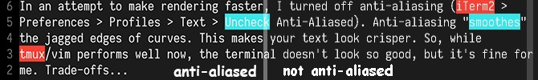

I really like using tmux and vim, but it was unbearably slow on iTerm2 (afaik,
this is due to tmux. Running vim standalone is fine).
[Googling](https://github.com/tmux/tmux/issues/353) and profiling vim didn't
really help. [I concluded that the Mac terminal emulator is just slow
(?)](https://news.ycombinator.com/item?id=14798211).  Unfortunate.

I tried switching to Alacritty, which is very buttery, but I missed
some of the features that iTerm2 has (e.g., the hotkey window).

In an attempt to make rendering faster, I turned off anti-aliasing (iTerm2 >
Preferences > Profiles > Text > Uncheck Anti-Aliased). Anti-aliasing "smoothes"
the jagged edges of curves. This makes your text look crisper. So, while
tmux/vim performs well now, the terminal doesn't look so good, but it's fine for
me. Trade-offs...

Aesthetic comparison:

