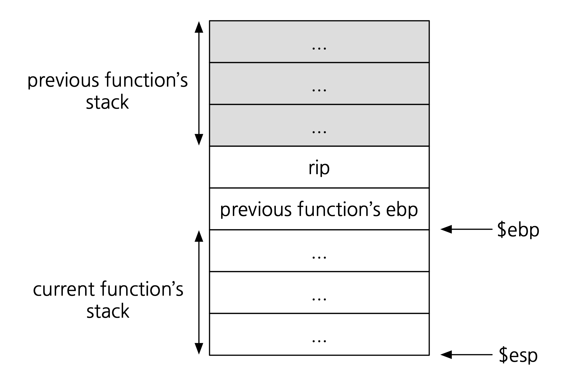
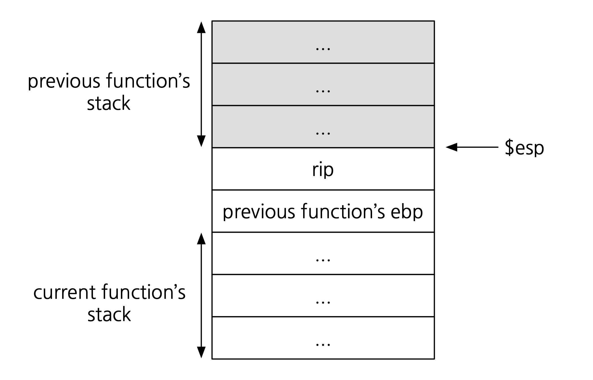
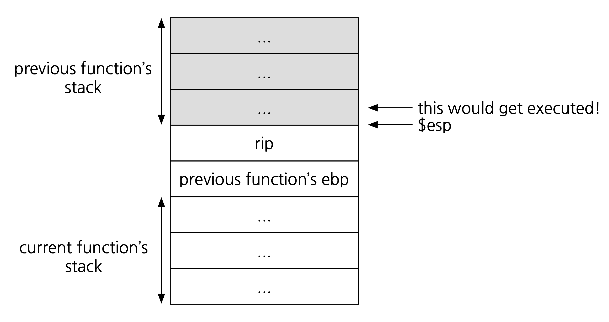
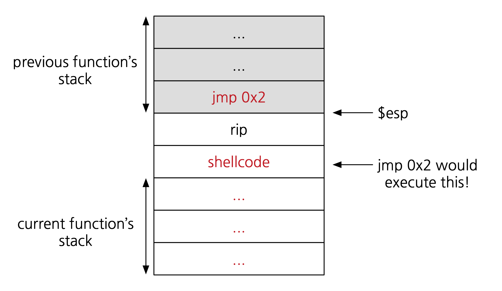

## Question 2
### Short Answer!
3. Assume ASLR is enabled. What vulnerability would arise if the instruction
   `jmp *esp` exists in memory?

   ASLR means we have to guess the stack address if we want to execute injected
   code. However, if there is a `jump *esp` instruction in a piece of memory
   that is *not* ASLR'd (e.g., text in most ASLR implementations), we can use
   this to find our way into the stack.

   The attacker could first do the following:
   1. Find the address `X` to the `jump *esp` instruction.
   2. Overwrite the return address to be `X`.

   Remember the memory layout of a program in the middle of executing a
   function:
   {:width="400px"}

   Now, recall the *function exit*:
   ```
   mov $ebp $esp
   pop $ebp
   ret // pops into $eip
   ```
   After `ret`, this is what our program's memory looks like:
   {:width="400px"}

   If the attacker accomplished steps 1 and 2, our program would then execute
   the instruction `jump *esp`. This means the first word at the bottom of the
   previous function's stack would be executed as an instruction:
   {:width="400px"}

   How can the attacker exploit this? One way would be to have that one
   instruction jump to another location. The attacker could insert shellcode
   at that new location, e.g., after the `rip`:
   {:width="400px"}

   In summary, the attacker could do the following to execute shellcode:

   1. Write shellcode after the current function's `rip`.
   2. Write `jmp 0x2` in the word before the `rip`.
   3. Find the address `X` to the `jump *esp` instruction.
   4. Overwrite the return address to be `X`.

## Question 3
Fun reading: [Reflections on
Trust](https://www.cs.cmu.edu/~rdriley/487/papers/Thompson_1984_ReflectionsonTrustingTrust.pdf)
by Ken Thompson.
