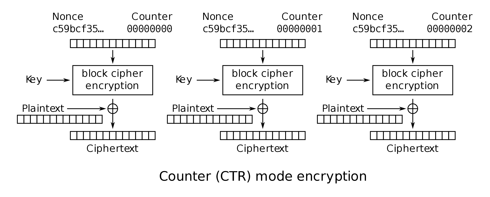

## Question 2

a) Suppose you have access to function $$R$$ that takes a 128-bit seed $$s$$ and
   integers $$n$$, $$m$$ as input. $$R$$ outputs the $$n$$th (inclusive) through
   $$m$$th (exclusive) bits produced by the a pseudorandom generator $$PRNG$$
   when it is seeded with seeds.

   $$RNG(s, n, m) = PRNG(s)[n:m]$$

   Use $$R$$ to make a secure symmetric-key encryption scheme.  That is, define
   the key generation algorithm, the encryption algorithm, and the decryption
   algorithm.

   ***

   Our inspiration for this algorithm comes from the [one-time
   pad](https://en.wikipedia.org/wiki/One-time_pad). A one-time pad is secure,
   **as long as the key is never reused in an encryption**. We can source a key
   for the encryption of each message from $$RNG$$ with $$S$$ being our key ($$s
   = K$$). Let $$M$$ be a 128-bit padded message. Our scheme is as follows:
   1. **Key Generation**. Set $$K \leftarrow_R \{0, 1\}^{128}$$ (a random
      128-bit number).
   2. **Encryption**. We can prevent reuse of one-time pad keys by keeping track
      of the random numbers we have consumed from $$RNG$$ with a variable $$j$$.

      $$Enc(K, M) = RNG(K, j, j+128) \oplus M || j$$

      Here, $$||$$ means concat, and we need to concat $$j$$ to our ciphertext for
      decryption. We also increment $$j$$ by $$128$$ after each encryption so
      our RNG gives us fresh random bits.
   3. **Decryption**. Remember $$x \oplus x = 0$$. Let $$\hat{C}$$ be the ciphertext
      from $$Enc$$.

      First, unpack $$j$$ from $$\hat{C}$$.

      $$C, j = \hat{C}_{0, \ldots, 127}, \hat{C}_{128}$$

      $$\begin{align}
      Dec(C, j, K) &= RNG(K, j, j+128) \oplus C \\
      &= RNG(K, j, j+128) \oplus RNG(K, j, j+128) \oplus M \\
      &= 0 \oplus M \\
      &= M
      \end{align}$$

***

b) Explain how using a block cipher in counter (CTR) mode is similar to the
   scenario described above.

***

   Below is the algorithm for CTR mode:
   
   There is a nonce (random number, also known as the initialization vector)
   that gets encrypted by a block cipher, producing a key for a one-time pad.
   The reason we have this nonce is that it makes the encryption
   non-deterministic *as long as the nonce is used once per encryption*.
   This is similar to the scheme above because we never reuse bits from
   $$PRNG$$.

   One advantage of CTR mode is that, unlike our scheme, its
   computation can be easily parallelized because each partition's encryption
   can be computed independently, given a nonce and a counter.
   Our scheme requires keeping track of $$j$$ across all encryptions, and also
   needs one bit from the PRNG for every bit in the message.

