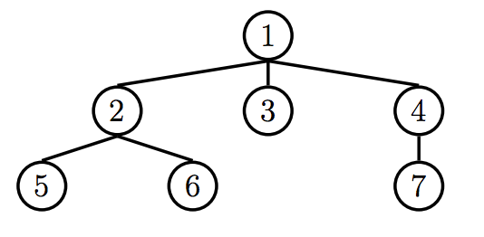

## Section 3.2 Question 2
Write a program flatten that given a Tree `t`, will return a linked list of the
elements of `t`, ordered by level. Entries on the same level should be ordered
from left to right. For example, the following tree will return the linked list
`<1 2 3 4 5 6 7>`.

<div align="center">
    
</div>

This problem actually touches on a concept that is not covered in this course
called [breadth first search](https://en.wikipedia.org/wiki/Breadth-first_search).
Take 61B for more info!

We can approach this problem in two ways, using just a list, or traversing the
tree twice:

    1. To give each node a "level"
    2. To put together our linked list, based on the levels we assigned each
       node.

### Intuitive Approach
Let's first try the intuitive approach, which is to traverse `t` twice. On
the first traversal, I will have to keep track of the level of every node.
Let's do this with a dictionary that keeps a list of each node at a level (which
will be the key).

```python
levels = {}
define traverser(t, level)
    if level not in levels:
        levels[level] = []
    levels[level].append(t)
    [traverser(c, level + 1) for c in t.children]
```

Now that we have all of our levels (and conveniently, the nodes on the same 
level will be ordered from left to right because we traverse our children from
left to right), we just have to stick it into a Linked List. This part is
a little messy.

```python
list_of_nodes = []
for l in range(len(levels)): # dictionaries are unordered!
    for n in levels[l]:
        list_of_nodes.append(n.entry)

def converter(lst):
    if not lst:
        return Link.empty
    return Link(lst[0], converter(lst[1:]))

converter(list_of_nodes)
```

Putting it together:

```python
define flatten(t):
    levels = {}
    define traverser(t, level)
        if level not in levels:
            levels[level] = []
        levels[level].append(t)
        [traverser(c, level + 1) for c in t.children]
    traverser(t, 0)
    list_of_nodes = []
    for l in range(len(levels)): # dictionaries are unordered!
        for n in levels[l]:
            list_of_nodes.append(n.entry)

    def converter(lst):
        if not lst:
            return Link.empty
        return Link(lst[0], converter(lst[1:]))

    converter(list_of_nodes)
```

### Approach with List (Queue)
Now let's go over a way to solve this problem with only a list. The key
understanding is that when we traverse a tree, it's possible to make a list
of the nodes in the order that we want.

<div align="center">
    
</div>

For example, when we start at the root node, we can form a list of nodes
(children) that we will want to collect entries from. At the root node `1`, we
can form a list, or a queue, of nodes to traverse next - the nodes `2`, `3`, and
`4`. If this list can be mutated by each function call, we can use this list to
figure out which node to look at next. 

In the simplest case, our list, after traversing the root node's children would
be `[2, 3, 4]` (we will traverse the node `2` next). After we traverse the node
`2`, we would just tack on what we have to explore (`2`'s children) to the *end*
of our list. So our list of nodes we still need to explore would look like this:

```python
[3, 4, 5, 6] # we explored node 2 already
```

Now that we have the order of exploration down, we can just return the Linked
List of the current entry, and a recursive call to our helper function. Putting
that together:

```python
define flatten(t):
    def flatten_helper(queue):
        if not queue: # queue is empty, we're done exploring
            return Link.empty
        curr = queue.pop(0) # removes the first element of the queue
        for c in curr.children:
            queue.append(c) # we add future nodes to explore to the end
        return Link(curr.entry, flatten_helper(queue))
    return flatten_helper([t]) # start it off with the root node
```
